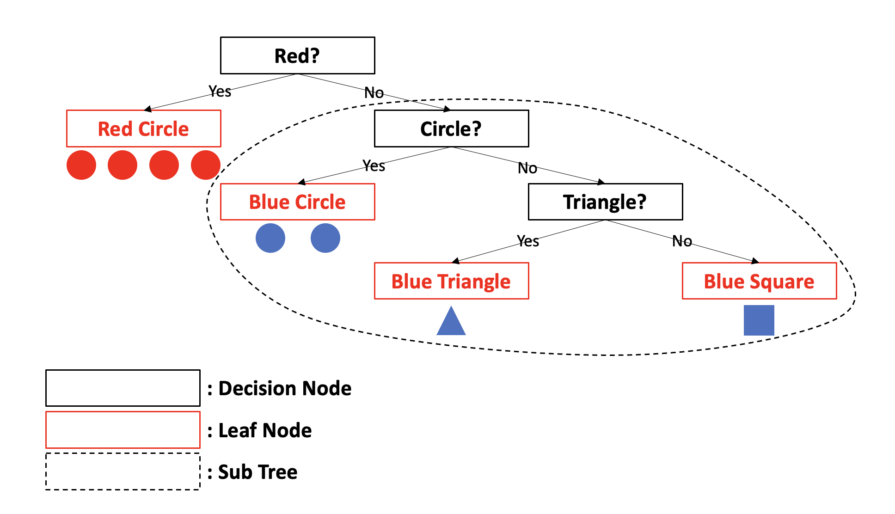
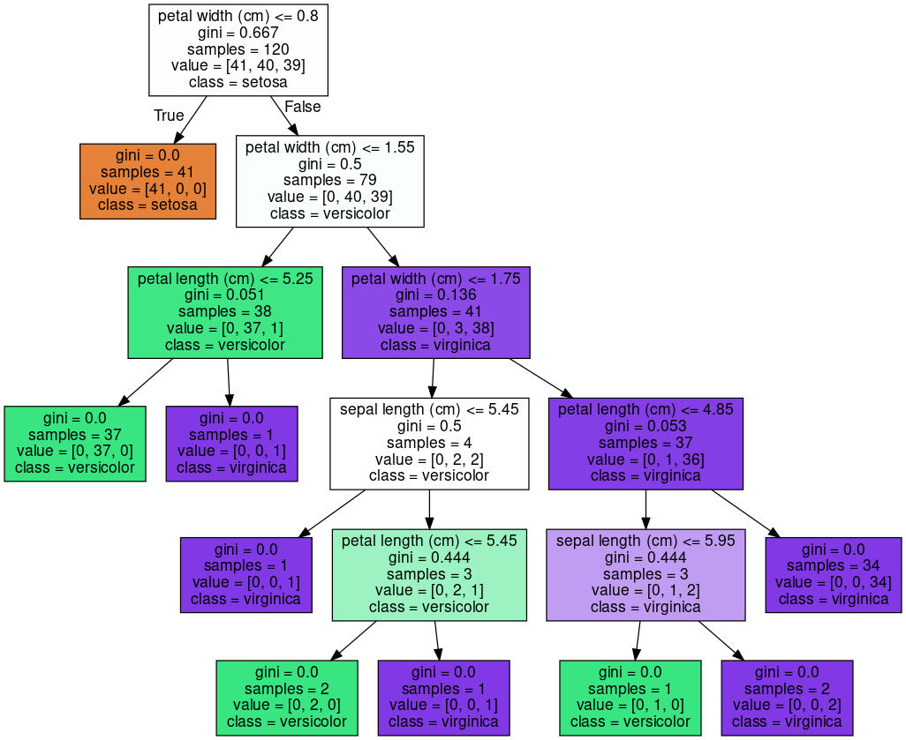
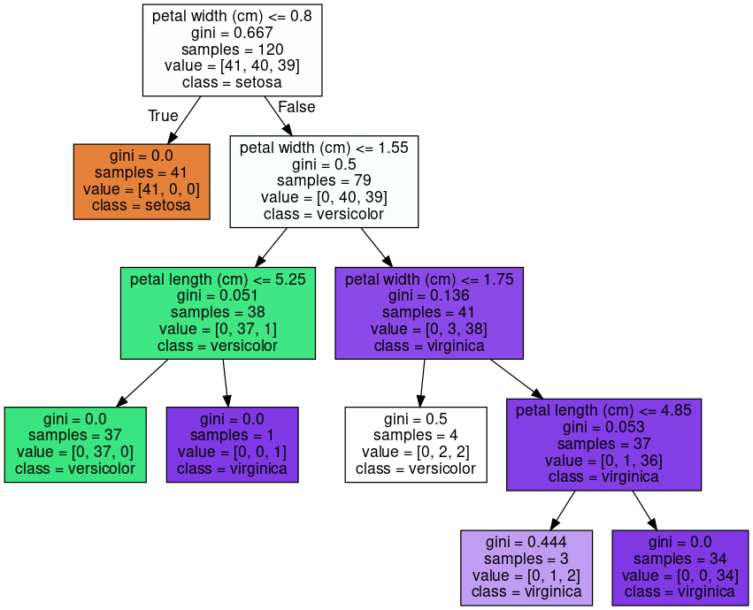

동작 원리, 하이퍼 파라미터, 시각화, 피처 중요도

----

안녕하세요.
데이터 사이언티스트를 위한 정보를 공유하고 있습니다.

M1 Macbook Air를 사용하고 있으며, 블로그의 모든 글은 Mac을 기준으로 작성된 점 참고해주세요.

----

# Decision Tree(결정 트리)

Decision Tree 모델은 if-then-else 규칙을 직관적으로 잘 구현한 모델입니다.

Linear Regression이나 Logistic Regression과 달리

데이터에 존재하는 복잡한 상호 관계에 따른 숨겨진 패턴들을 스스로 발견하는 능력이 있어서

Decision Tree 모델을 기반으로 하는 머신러닝 모델들이 요즘 대중적으로 많이 사용되고 있습니다.

직관적인 이해를 돕기 위해 다음 그림을 먼저 살펴보겠습니다.



Decision Tree 모델의 알고리즘을 직관적으로 이해하기 위해 그린 그림입니다.

보시다시피 스무고개 게임 방식과 유사합니다.

각각의 Decision Node의 규칙에 따라 Yes/No로 나뉘어지고,

새로 나뉘어질 때마다 새로운 Sub Tree가 생성됩니다.

그리고 분류가 완료된 마지막 노드를 Leaf Node라고 합니다.

위 그림에 따라 다시 설명하면,

Red인지, Circle인지, Triangle인지에 대한 기준을 나누는 것을 Decision Node,

각 Decision Node에 따라 분류될 때마다 새로 생성되는 Tree를 Sub Tree라고 하며,

Red Circle, Blue Circle, Blue Triangle, Blue Square로 최종적으로 분류된 각 클래스가 Leaf Node에 해당합니다.

규칙이 많을수록, 즉 트리의 깊이(depth)가 깊어질수록,

혹은 여러번 나뉠수록 분류를 결정하는 방식이 더 복잡해진다는 뜻이고,

이는 과적합(overfitting)을 초래할 우려가 있습니다.

따라서 어떻게 트리를 분할할 것인지가 매우 중요합니다.

----

Decision Tree의 경우 Decision Node는 균일도가 높은 데이터 세트를 먼저 선택할 수 있도록 조건을 만듭니다.

위 그림에서는 'Red?'라는 조건으로 yes에 해당하는 데이터의 균일도가 높게 분류가 되었죠.

이처럼 균일도를 따져가며 트리를 분할하는 것이 가장 효율적인 방식입니다.

균일도를 측정하는 방법에는 크게 **정보 이득(Information Gain)**과 **지니 계수**가 있습니다.

**정보 이득**은 엔트로피라는 개념을 기반으로 합니다.

엔트로피는 데이터의 복잡도 혹은 혼잡도를 의미하는데 데이터가 균일하지 않을수록 높은 수치를 나타냅니다.

이때 정보 이득은 1에서 엔트로피를 뺀 값으로,

높을수록 데이터가 균일합니다.

**지니 계수**는 경제학에서 불평등 지수를 나타낼 때 사용하는 계수인데,

머신러닝의 경우에는 낮을수록 데이터가 균일합니다.

사이킷런의 DecisionTreeClassifier는 지니 계수를 이용하여 노드 분할을 합니다.

----

Decision Tree 모델의 장단점을 살펴보겠습니다.

**장점**

- 알고리즘이 쉽고 직관적
- 시각화로 표현 가능
- 균일도만 신경 쓰면 되므로 특별한 경우를 제외하고 스케일링과 같은 전처리 작업이 필요 없음

**단점**

- 과적합 문제로 성능이 떨어짐
- 피처가 많고 데이터가 복잡할수록 트리의 깊이가 깊어짐

성능 하락으로 이어지는 과적합 문제는 머신러닝 관점에서 굉장히 중요한 이슈입니다.

학습 데이터를 완벽하게 학습하기 위해 복잡하지만 완벽한 규칙을 만들게 되면

학습 데이터에 과적합되어 테스트 데이터에서 좋은 성능을 보이기 어려워집니다.

따라서 Decision Tree 모델을 다룰 때는

차라리 완벽한 규칙을 만들지 않고 트리의 크기를 제한하는 방식을 택하여 성능을 향상시킵니다.

----

다음은 Decision Tree의 구조를 시각화해 보겠습니다.

데이터는 사이킷런의 붓꽃 데이터를 사용하겠습니다.

In:


```python
from sklearn.datasets import load_iris
from sklearn.tree import DecisionTreeClassifier
from sklearn.model_selection import train_test_split

import warnings
warnings.filterwarnings("ignore")


iris_data = load_iris()

X_train, X_test, y_train, y_test = train_test_split(iris_data.data, iris_data.target,
                                                    test_size = 0.2, random_state = 11)

dt = DecisionTreeClassifier(random_state = 11)
dt.fit(X_train, y_train)
```

우리는 시각화를 위해 Graphviz라는 클래스를 사용할 것입니다.

sklearn.tree 모듈은 export_graphviz()라는 함수를 제공하는데

이 함수는 Graphviz로 그래프 형태로 시각화하기 위한 파일을 생성합니다.

In:


```python
from sklearn.tree import export_graphviz

export_graphviz(dt, out_file = "tree.dot", class_names = iris_data.target_names,
                feature_names = iris_data.feature_names, impurity = True, filled = True)
```

export_graphviz의 첫 번째 파라미터는 **estimator**입니다.

이후 순서대로 파라미터를 살펴보면,

**out_file**: output 파일 명을 나타냅니다.

**class_names**: 클래스 명을 나타냅니다. 붓꽃 데이터에서는 'Setosa', 'Versicolor', 'Virginica'가 클래스 명에 해당합니다.

**feature_names**: 피처 명을 나타냅니다. 붓꽃 데이터에서는 'petal width (cm)', 'petal length (cm)', 'sepal width (cm)', 'sepal length (cm)'가 피처 명에 해당합니다.

**impurity**: 균일도, 즉 지니 계수를 나타내는지 여부를 결정합니다. default는 true입니다.

**filled**: 색을 채우는지 여부를 결정합니다. default는 false입니다.

In:


```python
import graphviz

with open("tree.dot") as f:
  dot_graph = f.read()
# 'tree.dot'이라는 파일을 f로 받아 읽어서 'dot_graph'라는 이름으로 저장
# 파일을 열고, 사용한 후에는 파일을 닫아주는 과정이 필요
# with as 문법을 사용하면 파일을 닫아주는 과정을 자동으로 처리

graphviz.Source(dot_graph)
# Graphviz로 Decision Tree 그리기
```

Out:




  In:


```python
from sklearn.metrics import accuracy_score

y_pred = dt.predict(X_test)
print(f"정확도: {accuracy_score(y_test, y_pred):.4f}")
```

Out:

    정확도: 0.9333


위 그림은 끝까지 완벽하게 분류한 모습이고, 약 93.33% 정확도를 확인하였습니다.

그림을 해석해 보겠습니다.

하나의 클래스로만 남아 더 이상 분류할 필요가 없거나, 하이퍼 파라미터에서 설정한 조건을 만족하는 경우

노드는 Leaf Node로서 자식 노드가 없는 상태가 됩니다.

그 외의 Decision Node에는 **데이터를 분할하기 위한 조건**이 기입되어 있습니다.

**gini**값은 해당 노드에서의 데이터의 균일도, 즉 지니 계수를,

**samples**는 해당 노드에서의 데이터 샘플 수를,

**value**는 각 클래스 별 데이터 샘플 수를,

**class**는 데이터 샘플 수가 가장 많은 클래스를 나타냅니다.

----

다음은 Decision Tree 모델의 하이퍼 파라미터들이 가지는 의미를 Graphviz로 확인하며 살펴보겠습니다.

**max_depth**: 트리의 최대 깊이를 규정하고 default는 None입니다. 따라서 완벽하게 클래스가 분류될 때까지 노드를 분할합니다.

max_depth를 3으로 설정하면 결과는 다음과 같습니다.

In:


```python
dt = DecisionTreeClassifier(max_depth = 3, random_state = 11)
dt.fit(X_train, y_train)

export_graphviz(dt, out_file = "tree.dot", class_names = iris_data.target_names,
                feature_names = iris_data.feature_names, impurity = True, filled = True)

with open("tree.dot") as f:
  dot_graph = f.read()

graphviz.Source(dot_graph)
```

Out:


max_depth를 제한함으로써 트리의 구조가 간단해진 것을 확인할 수 있었습니다.

max_depth를 크게 지정할수록 분할되는 노드의 수가 많아져서 과적합의 가능성은 커집니다.

**min_samples_split**: 노드를 분할하기 위한 최소한의 샘플 개수를 의미하며, default는 2입니다.

min_samples_split을 10으로 설정하겠습니다.

In:


```python
dt = DecisionTreeClassifier(min_samples_split = 10, random_state = 11)
dt.fit(X_train, y_train)

export_graphviz(dt, out_file = "tree.dot", class_names = iris_data.target_names,
                feature_names = iris_data.feature_names, impurity = True, filled = True)

with open("tree.dot") as f:
  dot_graph = f.read()

graphviz.Source(dot_graph)
```

Out:



클래스가 완벽하게 분류되지 않아도 데이터 샘플 수가 10개보다 적으면 더 이상 노드가 분할되지 않는 모습입니다.

작게 지정할수록 분할되는 노드의 수가 많아져서 과적합의 가능성은 커집니다.

이외의 하이퍼 파라미터는 설명만 하도록 하겠습니다.

**min_samples_leaf**: Leaf Node가 되기 위한 최소한의 샘플 데이터 수를 의미하며, default는 1입니다. 작게 지정할수록 분할되는 노드의 수가 많아져서 과적합의 가능성은 커집니다.

**max_features**: 최대 피처의 개수를 지정하며, default는 None입니다. None일 때는 모든 피처를 선정합니다. int형으로 지정하면 해당 숫자만큼의 피처의 개수, float형으로 지정하면 해당 숫자 퍼센트 만큼의 피처의 개수를 선정합니다. 'sqrt'나 'auto'로 지정하면 sqrt(피처의 개수)만큼, 'log'로 지정하면 log2(피처의 개수)만큼의 피처의 개수를 선정합니다.

**max_leaf_nodes**: Leaf Node의 최대 개수를 나타내며, default는 None입니다.

----

Decision Tree는 되도록 균일하게 데이터를 분류하기 위한

Decision Node에서 최적의 조건을 만들어 노드를 분할할 것 입니다.

그래야 더 간결하고 이상치(outlier)에 강한 모델을 만들 수 있기 때문입니다.

이를 위해 Decision Tree 모델은 데이터에서 각 피처의 중요도를 따지게 되는데요.

DecisionTreeClassifier 객체의 feature_importances_ 속성을 반환해 보면 중요도를 어떻게 산정하였는지 확인할 수 있습니다.

DecisionTreeClassifier의 하이퍼 파라미터가 default일 때를 기준으로 살펴보겠습니다.

In:


```python
import numpy as np

dt = DecisionTreeClassifier(random_state = 100)
dt.fit(X_train, y_train)

feature_importances = np.round(dt.feature_importances_, 4)

print("각 피처의 중요도")

for feature_name, feature_importance in zip(iris_data.feature_names, feature_importances):
  print(f"{feature_name}: {feature_importance}")
```

Out:

    각 피처의 중요도
    sepal length (cm): 0.0167
    sepal width (cm): 0.0
    petal length (cm): 0.5632
    petal width (cm): 0.4201


이 모델에서는 'petal length (cm)' 피처의 중요도가 가장 높게 나왔고,

각 피처에 대한 중요도는 Decision Tree 모델의 파라미터를 어떻게 구성하느냐에 따라 달라집니다.

우리는 지금까지 시각화 결과와 피처의 중요도를 확인하며 Decision Tree의 구조 및 동작 원리에 대한 직관적인 이해가 쉽다는 것을 알게 되었습니다.

----

읽어주셔서 감사합니다.

정보 공유의 목적으로 만들어진 블로그입니다.

미흡한 점은 언제든 댓글로 지적해주시면 감사하겠습니다.

----
