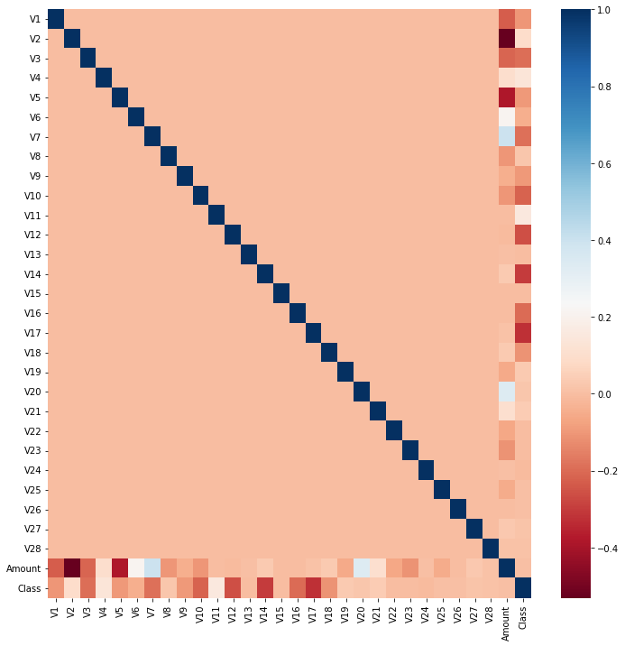
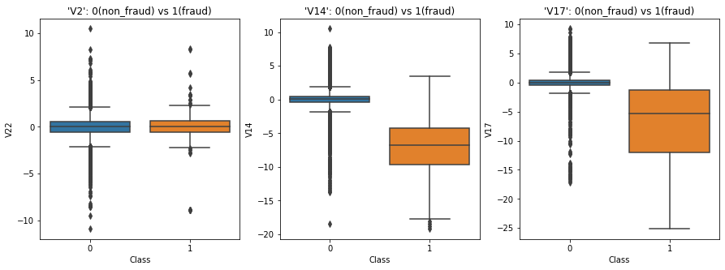

Outlier, Box plot, IQR, heatmap

----

안녕하세요.
데이터 사이언티스트를 위한 정보를 공유하고 있습니다.

M1 Macbook Air를 사용하고 있으며, 블로그의 모든 글은 Mac을 기준으로 작성된 점 참고해주세요.

----

# 이상치(Outlier) 제거 - IQR 방식

이상치는 전체 데이터의 패턴에서 벗어난 값을 의미하며 머신러닝 모델의 성능에 영향을 줄 수 있습니다.

이번 포스팅에서는 이러한 이상치를 찾는 방법과 제거하는 방법에 대해 소개하려고 합니다.

이상치를 찾는 여러 방법 중 IQR(Inter Quantile Range) 방식을 사용할 건데,

IQR에 대한 자세한 설명은 [데이터 스케일링(Data Scaling)](https://jeongchangsu.github.io/scikitlearn08/) 글의 4. RobustScaler 부분에서 확인해 주시길 바랍니다.

IQR을 간단히 그림으로 확인하면 다음과 같습니다.


그리고 IQR 방식으로 이상치를 제거한다는 것은

Q3에서 IQR * 1.5를 더한 값을 최댓값,

Q1에서 IQR * 1.5를 뺀 값을 최솟값으로 지정하고,

최댓값보다 크거나 최솟값보다 작은 값을 이상치로 간주하여 제거하는 것입니다.

여기서 1.5라는 숫자는 임의로 정할 수 있습니다.

이러한 방식을 시각화한 것이 박스 플롯이고, 그림으로 확인해 보면 다음과 같습니다.


----

이제 캐글의 신용 카드 사기 탐지 데이터를 활용하여 이상치를 확인 후 제거하고,

이상치 제거 전후의 모델의 성능을 확인해 보겠습니다.([Kaggle Credit Card Fraud Detection](https://www.kaggle.com/mlg-ulb/creditcardfraud))

In:


```python
import pandas as pd

card_data = pd.read_csv("/content/drive/MyDrive/Colab Notebooks/creditcard.csv")
card_data.drop("Time", axis = 1, inplace = True)
card_data.head()
```

Out:

<table border="1" class="dataframe">
  <thead>
    <tr style="text-align: right;">
      <th></th>
      <th>V1</th>
      <th>V2</th>
      <th>V3</th>
      <th>V4</th>
      <th>V5</th>
      <th>V6</th>
      <th>V7</th>
      <th>V8</th>
      <th>V9</th>
      <th>V10</th>
      <th>...</th>
      <th>V21</th>
      <th>V22</th>
      <th>V23</th>
      <th>V24</th>
      <th>V25</th>
      <th>V26</th>
      <th>V27</th>
      <th>V28</th>
      <th>Amount</th>
      <th>Class</th>
    </tr>
  </thead>
  <tbody>
    <tr>
      <th>0</th>
      <td>-1.359807</td>
      <td>-0.072781</td>
      <td>2.536347</td>
      <td>1.378155</td>
      <td>-0.338321</td>
      <td>0.462388</td>
      <td>0.239599</td>
      <td>0.098698</td>
      <td>0.363787</td>
      <td>0.090794</td>
      <td>...</td>
      <td>-0.018307</td>
      <td>0.277838</td>
      <td>-0.110474</td>
      <td>0.066928</td>
      <td>0.128539</td>
      <td>-0.189115</td>
      <td>0.133558</td>
      <td>-0.021053</td>
      <td>149.62</td>
      <td>0</td>
    </tr>
    <tr>
      <th>1</th>
      <td>1.191857</td>
      <td>0.266151</td>
      <td>0.166480</td>
      <td>0.448154</td>
      <td>0.060018</td>
      <td>-0.082361</td>
      <td>-0.078803</td>
      <td>0.085102</td>
      <td>-0.255425</td>
      <td>-0.166974</td>
      <td>...</td>
      <td>-0.225775</td>
      <td>-0.638672</td>
      <td>0.101288</td>
      <td>-0.339846</td>
      <td>0.167170</td>
      <td>0.125895</td>
      <td>-0.008983</td>
      <td>0.014724</td>
      <td>2.69</td>
      <td>0</td>
    </tr>
    <tr>
      <th>2</th>
      <td>-1.358354</td>
      <td>-1.340163</td>
      <td>1.773209</td>
      <td>0.379780</td>
      <td>-0.503198</td>
      <td>1.800499</td>
      <td>0.791461</td>
      <td>0.247676</td>
      <td>-1.514654</td>
      <td>0.207643</td>
      <td>...</td>
      <td>0.247998</td>
      <td>0.771679</td>
      <td>0.909412</td>
      <td>-0.689281</td>
      <td>-0.327642</td>
      <td>-0.139097</td>
      <td>-0.055353</td>
      <td>-0.059752</td>
      <td>378.66</td>
      <td>0</td>
    </tr>
    <tr>
      <th>3</th>
      <td>-0.966272</td>
      <td>-0.185226</td>
      <td>1.792993</td>
      <td>-0.863291</td>
      <td>-0.010309</td>
      <td>1.247203</td>
      <td>0.237609</td>
      <td>0.377436</td>
      <td>-1.387024</td>
      <td>-0.054952</td>
      <td>...</td>
      <td>-0.108300</td>
      <td>0.005274</td>
      <td>-0.190321</td>
      <td>-1.175575</td>
      <td>0.647376</td>
      <td>-0.221929</td>
      <td>0.062723</td>
      <td>0.061458</td>
      <td>123.50</td>
      <td>0</td>
    </tr>
    <tr>
      <th>4</th>
      <td>-1.158233</td>
      <td>0.877737</td>
      <td>1.548718</td>
      <td>0.403034</td>
      <td>-0.407193</td>
      <td>0.095921</td>
      <td>0.592941</td>
      <td>-0.270533</td>
      <td>0.817739</td>
      <td>0.753074</td>
      <td>...</td>
      <td>-0.009431</td>
      <td>0.798278</td>
      <td>-0.137458</td>
      <td>0.141267</td>
      <td>-0.206010</td>
      <td>0.502292</td>
      <td>0.219422</td>
      <td>0.215153</td>
      <td>69.99</td>
      <td>0</td>
    </tr>
  </tbody>
</table>
<p>5 rows × 30 columns</p>

먼저 이상치 데이터를 제거해 볼 건데요.

이상치를 제거할 피처부터 선택해야 합니다.

피처가 많을수록 이상치를 탐지하는 데 시간이 오래 걸리며,

이상치를 제거하는 것이 무조건 모델의 성능 향상에 직결되는 것은 아니기 때문입니다.

따라서 각 피처와 타겟 변수 간의 상관관계를 먼저 확인하고,

그중에서 상관성이 높은 변수가 이상치를 제거할 우선순위가 될 것입니다.

상관성이 높지 않은 피처는 이상치를 제거하더라도 성능 향상에 크게 기여하지 않기 때문이죠.

그럼 heatmap을 통해 피처 간의 상관관계를 확인해 보겠습니다.

In:


```python
import seaborn as sns
import matplotlib.pyplot as plt

plt.figure(figsize = (12, 12))
correlation = card_data.corr()
# 각 변수 간의 상관성을 표로 나타냄
sns.heatmap(correlation, cmap = "RdBu")
# heatmap으로 그려 상관도를 시각화
```

Out:    



위 heatmap에서 피처 간의 양의 상관관계가 높을수록 파랑, 음의 상관관계가 높을수록 빨강으로 나타나게 됩니다.

따라서 타겟 변수, 즉 'Class' 피처와 상관관계가 가장 높아 보이는 피처는 'V14'와, 'V17'인 것으로 보입니다.

그럼 이번에는 'V2', 'V14', 'V17'의 클래스 별 박스 플롯을 그려 데이터의 분포, 이상치의 분포를 직접 확인해 보겠습니다.

In:


```python
fig, axes = plt.subplots(ncols = 3, figsize = (15, 5))

sns.boxplot(x = "Class", y = "V22", data = card_data, ax = axes[0])
axes[0].set_title("'V2': 0(non_fraud) vs 1(fraud)")
sns.boxplot(x = "Class", y = "V14", data = card_data, ax = axes[1])
axes[1].set_title("'V14': 0(non_fraud) vs 1(fraud)")
sns.boxplot(x = "Class", y = "V17", data = card_data, ax = axes[2])
axes[2].set_title("'V17': 0(non_fraud) vs 1(fraud)")
```

Out:




'V2'와 달리 'V14'와 'V17'에서 'Class'의 0과 1에 대한 분포가 확실히 구분되는 모습입니다.

즉 heatmap에서 'V14'와 'V17'의 타겟 변수와의 상관관계가 높았듯이

박스 플롯을 통해서도 'V14'와 'V17'이 클래스를 구분하는 데 큰 영향을 미친다는 것을 확인할 수 있었습니다.

다음은 이상치를 제거하는 함수를 만들어 데이터에 적용해 보겠습니다.

In:


```python
import numpy as np

# 이상치 제거 함수
def remove_outlier(df, columns, weight = 1.5):
# IQR * weight에서 weight의 default를 1.5로 지정
  
  new_df = df.copy()
  for column in columns:
    fraud = new_df[new_df["Class"] == 0][column]
    # 이상치가 많았던 클래스 0

    Q1 = np.percentile(fraud.values, 25)
    # 2사분위수(Q1)
    # 백분위수 중 하위 25%인 지점을 추출
    Q3 = np.percentile(fraud.values, 75)
    # 3사분위수(Q3)

    iqr = Q3 - Q1
    iqr_weight = iqr * weight

    lowest_val = Q1 - iqr_weight
    # 최솟값
    highest_val = Q3 + iqr_weight
    # 최댓값

    outlier_index = fraud[(fraud < lowest_val) | (fraud > highest_val)].index
    # 최솟값보다 작고, 최댓값보다 큰 이상치 데이터들의 인덱스

    new_df.drop(outlier_index, inplace = True)
    # 전체 데이터에서 이상치 데이터 제거
    new_df.reset_index(drop = True, inplace = True)

  return new_df
```

In:


```python
remove_outlier_df = remove_outlier(card_data, ["V14", "V17"])
print(f"이상치 제거 전: {card_data.shape}")
print(f"이상치 제거 후: {remove_outlier_df.shape}")
```

Out:

    이상치 제거 전: (284807, 30)
    이상치 제거 후: (267429, 30)


클래스가 0인 데이터와 1인 데이터를 모두 포함시켜서 한 번에 이상치 탐지를 하면

두 개의 클래스가 하나의 같은 기준으로 이상치 제거가 됩니다.

즉 서로 다른 클래스의 데이터가 같은 기준으로 박스 플롯이 그려지게 된다는 것인데

이는 이상치를 올바르게 탐지했다고 보기 어렵습니다.

따라서 저는 클래스 별 박스 플롯을 확인하였을 때

상대적으로 이상치가 훨씬 많았던, 클래스가 0인 데이터의 이상치를 제거해보았습니다.

그 결과 데이터는 284,807 -> 267,429로 줄었습니다.

즉 총 17,378개의 이상치 데이터가 제거되었습니다.

이제 마지막으로 LightGBM 모델과 LogisticRegression 모델로 분류 예측을 진행하여 이상치 제거 전후의 모델의 성능을 비교해 보겠습니다.

In:


```python
from sklearn.model_selection import train_test_split
from sklearn.metrics import confusion_matrix, precision_score, recall_score, f1_score, roc_auc_score
from sklearn.linear_model import LogisticRegression
from lightgbm import LGBMClassifier

import warnings
warnings.filterwarnings("ignore")

# 여러 평가지표를 한 번에 확인하기 위한 함수
def get_metrics(y_test, y_pred, y_pred_proba):
  print(f"Confusion Matrix: {confusion_matrix(y_test, y_pred)}")
  print(f"Precision Score: {precision_score(y_test, y_pred):.4f}")
  print(f"Recall Score: {recall_score(y_test, y_pred):.4f}")
  print(f"F1 Score: {f1_score(y_test, y_pred):.4f}")
  print(f"AUC Score: {roc_auc_score(y_test, y_pred_proba):.4f}")

dfs = {"#### 이상치 제거 전 ####": card_data,
       "#### 이상치 제거 후 ####": remove_outlier_df}

for beforeafter, df in dfs.items():

  feature = df.drop("Class", axis = 1)
  target = df["Class"]

  X_train, X_test, y_train, y_test = train_test_split(feature, target,
                                                      test_size = 0.2, random_state = 11)

  # LightGBM 모델 학습 및 예측
  lgbm = LGBMClassifier(n_estimators = 500, learning_rate = 0.05, random_state = 11)
  evals = [(X_test, y_test)]
  lgbm.fit(X_train, y_train,
          early_stopping_rounds = 50,
          eval_metric = "logloss",
          eval_set = evals,
          verbose = False)
  lgbm_y_pred = lgbm.predict(X_test)
  lgbm_y_pred_proba = lgbm.predict_proba(X_test)[:, 1]

  # LogisticRegression 모델 학습 및 예측
  lr = LogisticRegression(random_state = 11)
  lr.fit(X_train, y_train)
  lr_y_pred = lr.predict(X_test)
  lr_y_pred_proba = lr.predict_proba(X_test)[:, 1]

  print(beforeafter)
  print("----------LightGBM----------")
  get_metrics(y_test, lgbm_y_pred, lgbm_y_pred_proba)
  print("\n")
  print("----------LogisticRegression----------")
  get_metrics(y_test, lr_y_pred, lr_y_pred_proba)
  print("\n\n")
```

Out:

    #### 이상치 제거 전 ####
    ----------LightGBM----------
    Confusion Matrix: [[56817    37]
     [   22    86]]
    Precision Score: 0.6992
    Recall Score: 0.7963
    F1 Score: 0.7446
    AUC Score: 0.9044

    ----------LogisticRegression----------
    Confusion Matrix: [[56836    18]
     [   34    74]]
    Precision Score: 0.8043
    Recall Score: 0.6852
    F1 Score: 0.7400
    AUC Score: 0.9448


​     
    #### 이상치 제거 후 ####
    ----------LightGBM----------
    Confusion Matrix: [[53376     5]
     [   10    95]]
    Precision Score: 0.9500
    Recall Score: 0.9048
    F1 Score: 0.9268
    AUC Score: 0.9711

    ----------LogisticRegression----------
    Confusion Matrix: [[53379     2]
     [   11    94]]
    Precision Score: 0.9792
    Recall Score: 0.8952
    F1 Score: 0.9353
    AUC Score: 0.9927


두 모델의 모든 성능 지표가 대폭 상승한 모습을 확인할 수 있었습니다.

이상치를 제거하는 것이 무조건 효과적인 것도 아니며,

다른 이상치를 추가적으로 제거했을 때 어떠한 결과를 보일지는 알 수 없습니다.

다만 포스팅에서의

피처와 타겟 변수 간 상관도 확인 -> 상관성 높은 피처의 이상치 제거

흐름처럼 합리적인 판단에 기반하여 이상치를 제거해 나간다면 보다 효율적으로 진행할 수 있을 것입니다.

----

읽어주셔서 감사합니다.

정보 공유의 목적으로 만들어진 블로그입니다.

미흡한 점은 언제든 댓글로 지적해주시면 감사하겠습니다.

----
