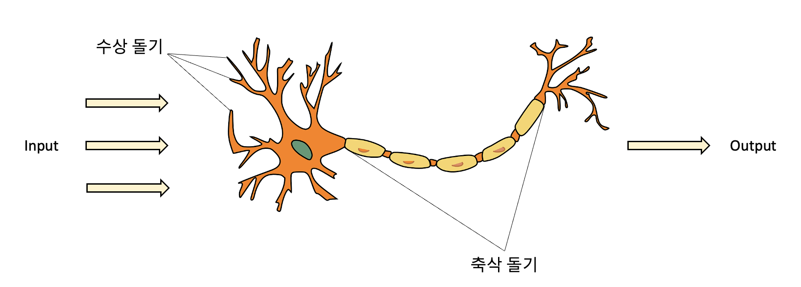
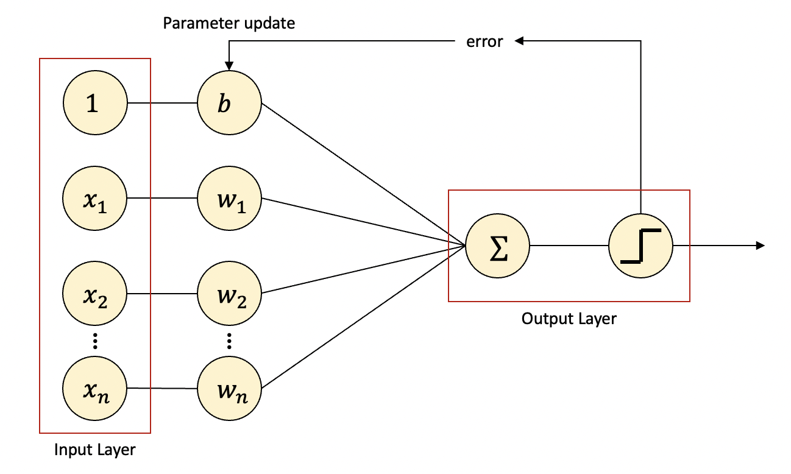
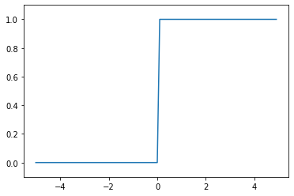
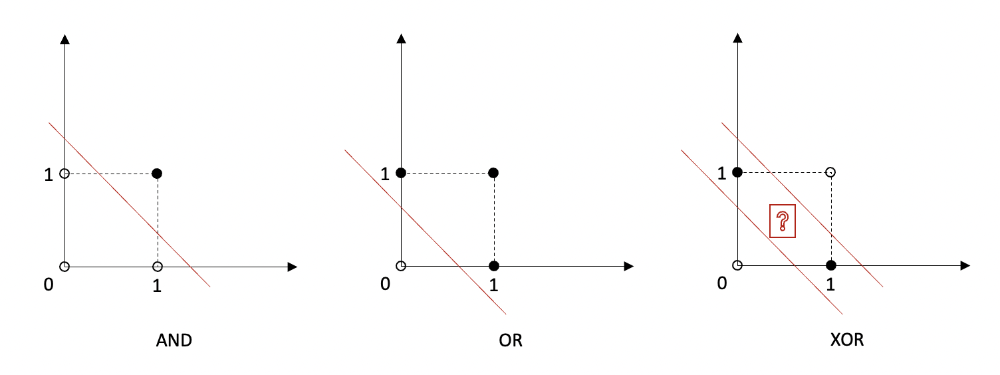
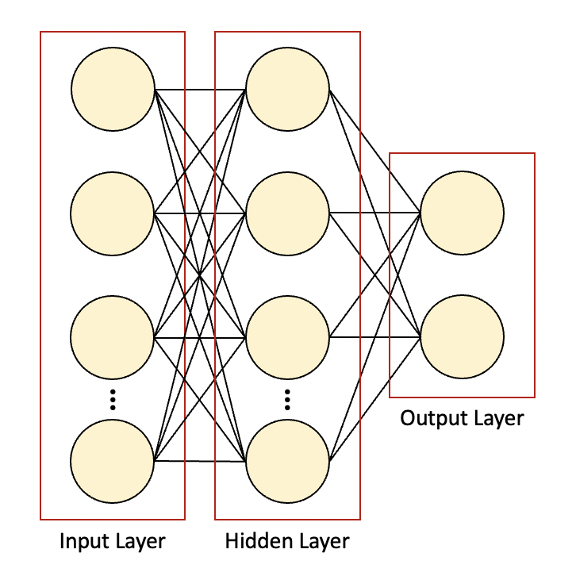

ANN, DNN, Deep Learning, Perceptron, MLP

----

안녕하세요.
데이터 사이언티스트를 위한 정보를 공유하고 있습니다.

M1 Macbook Air를 사용하고 있으며, 블로그의 모든 글은 Mac을 기준으로 작성된 점 참고해주세요.

----

# 퍼셉트론

딥러닝은 인간의 두뇌구조를 본뜬 인공 신경망(Artificial Neural Network)을 기반으로 합니다.

인공 신경망의 초기 모델은 퍼셉트론(Perceptron)입니다.

퍼셉트론은 Rosenblatt이 고안했는데,

인간 두뇌가 뉴런이 서로 연결된 상태로 전기신호를 내보내며 정보를 전달한다는 데 착안하여

비슷한 형태로 인공 뉴런이 연결된 구조의 인공 신경망을 구현한 것입니다.

1943년 McCulloch과 Pitts가 처음으로 간소화된 뇌의 뉴런 개념을 발표하였는데,

이들은 신경 세포를 이진 출력을 내는 간단한 논리 회로로 표현했습니다.

이를 맥컬록-피츠(MCP) 뉴런이라고 합니다.



위 그림은 뉴런을 나타내는 그림인데요.

수상 돌기에 여러 신호가 도착하여 세포체에 합쳐지고,

합쳐진 신호가 특정 임계값을 넘으면 출력 신호가 생성되고 축삭 돌기를 통해 전달됩니다.

이를 본따서 만들어진 퍼셉트론의 구조는 다음과 같습니다.



x는 입력값이고, w는 가중치(Weight)입니다.

b는 편향(bias)으로서 w와 함께 최적의 값을 향해 업데이트되는 파라미터입니다.

x와 파라미터는 곱해진 후에 Σ가 있는 인공 뉴런에서 모두 합산됩니다.

각 x마다 w가 존재하는데, w가 클수록 해당 입력값(피처)이 중요하다는 뜻입니다.

가중치 곱이 합산된 값(Weighted Sum)이 계단 함수(Step Function)에 따라,

임계치(Threshold)를 넘으면 1, 넘지 못하면 0을 출력합니다.

출력된 값과 실제값을 비교하여 오차를 계산하고 파라미터를 재설정하는 과정을 반복하는데

이를 최적화(Optimization)한다고 이야기합니다.

계단 함수 그래프를 시각화하면 다음과 같습니다.

In:


```python
import numpy as np
import matplotlib.pylab as plt

def step_function(x):
	return np.array(x > 0, dtype=np.int)
    
x = np.arange(-5.0, 5.0, 0.1)
y = step_function(x)
plt.plot(x,y)
plt.ylim(-0.1, 1.1)
plt.show()
```

Out:


    


이러한 계단 함수처럼 뉴런에서 출력값을 변경시키는 함수를 활성화 함수(Activation Function)이라고 불리며,

이후에 사용된 여러 활성화 함수도 있지만 퍼셉트론에서는 계단 함수가 사용되었습니다.

옵티마이저나 활성화 함수에 대해서는 추후에 자세히 다루도록 하겠습니다.

----

# MLP(Multi-Layer Perceptron), 딥러닝

위의 퍼셉트론을 단층 퍼셉트론(Single-Layer Perceptron)이라고 부릅니다.

입력층(Input Layer)과 출력층(Output Layer)으로 구성되어있죠.

하지만 퍼셉트론은 두 클래스가 선형적으로 구분 가능할 경우만 사용 가능합니다.

이해를 돕기 위해 게이트(gate)를 통해 설명해보겠습니다.

컴퓨터는 0과 1 두 개의 값이 무작위로 입력되었을 때

하나의 값이 출력되는 회로가 모여서 만들어지는데,

이 회로를 게이트라고 합니다.

여러 게이트 중 AND 게이트는 입력값이 모두 1이어야만 출력이 1인 게이트,

OR 게이트는 입력값 중 하나라도 1이면 출력이 1인 게이트,

XOR 게이트는 두 개의 입력값이 서로 다를 때 출력이 1인 게이트입니다.

출력이 0인 경우를 흰색 동그라미, 1인 경우를 검은색 동그라미로 하여

위 세 개의 게이트와, 각 게이트에서 0인 출력과 1인 출력을 나누는 퍼셉트론을 시각화해 보면 다음과 같습니다.



AND 게이트나 OR 게이트는 퍼셉트론에 의해 선형으로 완벽히 분류가 되는 모습인 반면,

XOR 게이트는 직선 하나로 0과 1을 분류할 수 없는 모습입니다.

이처럼 퍼셉트론은 몹시 단순한 XOR 게이트도 구현할 수 없는 것입니다.

적어도 두 개 이상의 선이 필요하다는 것을 확인할 수 있습니다.

일반적으로 대부분의 데이터는 매우 복잡하여 선형적으로 구분하는 것이 더 어려울 겁니다.

이러한 퍼셉트론의 한계를 극복한 방법이 바로 다층 퍼셉트론, MLP입니다.

XOR 게이트라면 AND, OR, NAND 게이트를 조합하여 만드는 것,

직선 한 개로 분류가 어려울 때 다른 직선을 더 추가하는 것,

퍼셉트론 관점에서는 층을 더 쌓는 방식입니다.

입력층과 출력층 사이에 추가적으로 쌓는 층을 바로 은닉층(Hidden Layer)이라고 합니다.



위 그림처럼 층 별 뉴런의 수, 은닉층의 수 등은 조절할 수 있습니다.

이처럼 은닉층이 한 개 이상 존재할 경우를 MLP라고 하고,

은닉층이 두 개 이상 존재하는 신경망을 심층 신경망(DNN, Deep Neural Network)이라고 합니다.

이번 포스팅의 서두에 딥러닝은 인공 신경망을 기반으로 학습하는 것이라 하였는데,

그 인공 신경망이 심층 신경망일 때, 즉 심측 신경망을 학습시킨다고 하여 딥러닝(Deep Learning)이라고 하는 것입니다.

----

앞서 다뤘듯이 딥러닝 알고리즘은 생각보다 복잡하거나 어려운 것이 아닙니다.

그럼에도 불구하고 딥러닝은 오랜 기간 동안 주목받지 못하였는데요.

요즘 딥러닝이 인공지능 섹터에서 가장 강력한 기술이 되었고, 또 발전이 빠른 이유는 여러 가지가 있습니다.

첫 번째는 딥러닝 알고리즘 그 자체의 발전입니다.

기울기 소실(gradient vanishing), 과적합 등 기존의 문제점과 한계를 극복한 것이죠.

두 번째는 데이터, 빅데이터입니다.

사실 앞서 말한 문제점을 극복하는 데 훨씬 더 효과적인 것이 데이터의 양을 늘리는 것입니다.

예를 들어 자연어 처리 문제에서 입력 단어의 수를 늘리는 것이 알고리즘을 개선하는 것보다 훨씬 드라마틱한 성능 향상을 보입니다.

이러한 빅데이터를 수집하고 저장하는 플랫폼이 생겼고 빅데이터는 근래에 가장 중요한 키워드 중 하나입니다.

세 번째는 시스템의 발전입니다.

인공 신경망은 수많은 노드 간의 단순 계산이 반복되는 구조이고,

이는 단순한 계산을 한꺼번에 많이 처리하는 GPU의 특징과 잘 맞습니다.

엔비디아의 GPU의 등장과 발전으로 인해 딥러닝 계산이 유리해진 것입니다.

엔비디아는 게임에 주로 사용되던 GPU를 다양한 분야에서 활용할 수 있게 하기위해 CUDA라는 플랫폼을 만들었고,

거의 대부분의 딥러닝 라이브러리는 CUDA를 우선으로 지원하고 있습니다(GPU 자체 생산을 할 수 있는 기업은 많으나 엔비디아가 독보적인 시장 점유율을 갖고 있는 이유).

마지막으로 오픈소스의 존재입니다.

오픈소스는 프로그램의 소스코드를 공개하는 것을 의미합니다.

구글의 텐서플로(TensorFlow), 페이스북의 파이토치(Pytorch)와 같은 딥러닝 라이브러리가 오픈소스로 공개되고,

코넬대학교에서 운영하는 아카이브라는 논문 사이트에는 논문이 무료로 등재되어 있습니다.

모든 이가 참여하는 것, 집단지성의 힘으로 딥러닝은 빠르게 발전하고 있는 것입니다.

----

읽어주셔서 감사합니다.

정보 공유의 목적으로 만들어진 블로그입니다.

미흡한 점은 언제든 댓글로 지적해주시면 감사하겠습니다.

----
