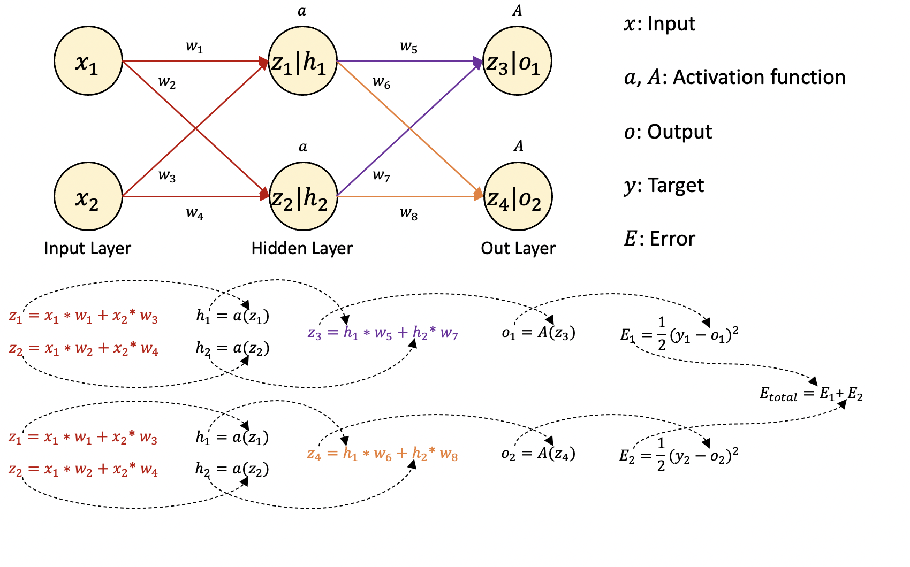
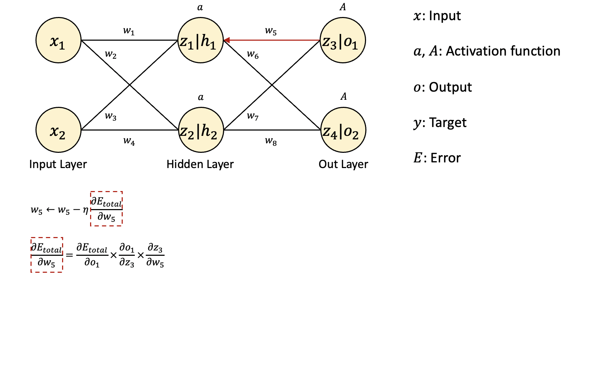
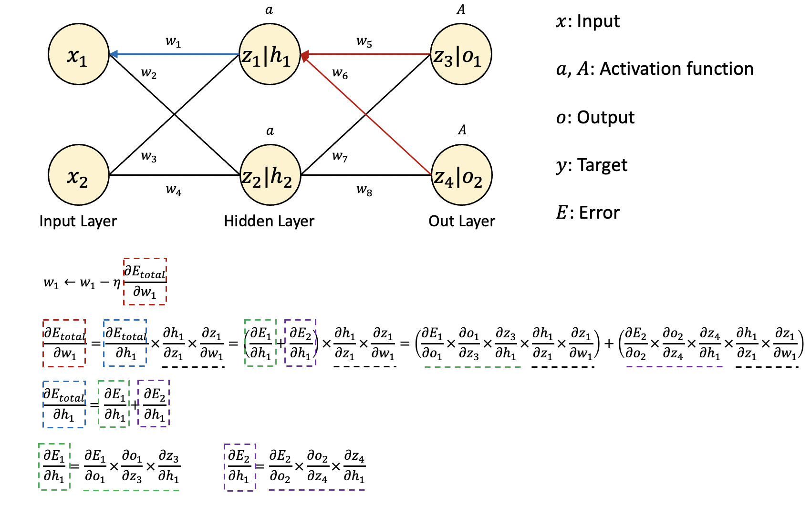

Backpropagation

----

안녕하세요.
데이터 사이언티스트를 위한 정보를 공유하고 있습니다.

M1 Macbook Air를 사용하고 있으며, 블로그의 모든 글은 Mac을 기준으로 작성된 점 참고해주세요.

----

심층 인공 신경망의 학습 방식은 다음과 같은 순서로 진행됩니다.

1. Feed-Forward 계산
2. Backpropagation을 수행하며 w 업데이트
3. 1, 2 반복

계산 과정을 더 자세히 살펴보도록 하겠습니다.

----

편의를 위해 단순한 인공신경망을 구성해보겠습니다.

먼저 Feed-Forward 계산, 즉 정방향으로 계산하여 오차를 계산해야합니다.

입력 데이터(x)에 가중치(w)가 곱해진 값은 다시 활성화 함수(a)를 통해 출력되고 이 과정은 출력층까지 반복됩니다.

마지막 출력층의 활성화 함수를 통해 출력되는 값이 바로 인공 신경망의 예측값(o)이 됩니다.

이 예측값과 실제값(y)을 비교하여 예측 오류(E)를 합산합니다.

예측 오류를 계산하는 손실 함수(loss function)는 MSE를 사용하였습니다.

----

# 역전파(Backpropagation) 알고리즘

앞선 경사 하강법이나 딥러닝 포스팅에서도 말씀드렸지만,

이제는 계산된 오류값을 감소시키는 방향으로 가중치를 업데이트해야 합니다.

이때 손실 함수의 기울기값을 활용한다고 말씀드렸고,

기울기값을 활용한다는 뜻은 곧 미분이 필요하다는 뜻입니다.

예측 오류를 구하기 위해 앞에서는 정방향으로 계산했다면,

가중치를 업데이트하기 위해서는 출력층부터 역순으로 기울기값을 전달하며 계산해야 합니다.

이것이 바로 역전파 알고리즘입니다.

그림에는 8개의 가중치가 있는데 그중에서 먼저 역전파 1단계에 계산되는 w5, w6, w7, w8 중에서 w5를 업데이트하는 과정을 살펴보겠습니다.

일반적인 경사 하강법을 기준으로 w5를 업데이트하기 위해서는

예측 오류를 w5에 대해 미분한 값에 학습률을 곱하고,

그 값을 기존의 w5에서 빼주어야 합니다.

계산식에서 미분 항은 미분의 연쇄 법칙(chain rule)을 활용하여 계산합니다.

연쇄 법칙에 의해 미분 항은 세 개의 항으로 나눌 수 있습니다.

각각의 항을 미분 계산하여 곱하면 원하는 결과를 얻을 수 있습니다.

w6, w7, w8도 같은 방식으로 구할 수 있습니다.

----

이번에는 역전파 2단계에서 계산되는 w1, w2, w3, w4 중에서 w1를 업데이트하는 과정을 살펴보겠습니다.

마찬가지로 예측 오류를 w1에 대해 미분한 값에 학습률을 곱하고,

그 값을 기존의 w1에서 빼주어야 합니다.

앞의 역전파 1단계와 다른 점은 이번에는 은닉층을 거쳐 업데이트되기 때문에

w1까지의 모든 경로가 반영되어야 합니다.

미분과 기본적인 수학 계산에 대한 이해도가 있다면 다음 그림의 수식을 천천히 따라가며 이해하실 수 있을 것입니다.

앞선 1단계의 과정과 원리는 같고,

w1과 관련된 모든 경로의 계산이 추가되면서 계산이 복잡해졌을 뿐입니다.

또한 마찬가지로 w2, w3, w4도 같은 방식으로 구할 수 있습니다.

----

위의 과정으로 업데이트된 가중치로 다시 순방향으로 예측 오류를 계산하면

예측 오류가 감소한 것을 확인할 수 있습니다.

예측 오류를 최소화하는 방향으로 위의 과정을 반복하는 것이 바로 인공 신경망의 학습법입니다.

----

읽어주셔서 감사합니다.

정보 공유의 목적으로 만들어진 블로그입니다.

미흡한 점은 언제든 댓글로 지적해주시면 감사하겠습니다.

----
