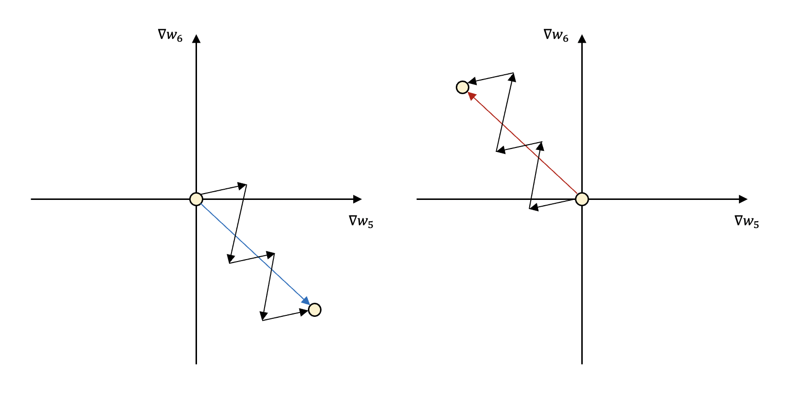

Sigmoid, Hyperblic Tangent, LeLU, LeakyLeLU, ELU, Softmax

----

안녕하세요.
데이터 사이언티스트를 위한 정보를 공유하고 있습니다.

M1 Macbook Air를 사용하고 있으며, 블로그의 모든 글은 Mac을 기준으로 작성된 점 참고해주세요.

----

# 활성화 함수(Activation Function)

딥러닝 포스팅에서 다루었듯이,

퍼셉트론에서는 출력이 0이 될지, 1이 될지 계단 함수(Step Function)로 결정하였습니다.

이렇듯 딥러닝 네트워크(은닉층과 출력층의 뉴런)에서 비선형성을 적용하여 출력값을 결정하는 함수를 활성화 함수라고 합니다.

그렇다면 계단 함수 외에 활성화 함수들을 살펴보도록 하겠습니다.

----

# 1. 시그모이드 함수(Sigmoid Function)와 기울기 소실 문제(Vanishing Gradient Problem)

먼저 시그모이드 함수의 형태를 확인해보겠습니다.

In:


```python
import numpy as np
import matplotlib.pyplot as plt

def sigmoid(x):
    return 1 / (1 + np.exp(-x))

x = np.arange(-5.0, 5.0, 0.1)
y = sigmoid(x)

plt.figure(figsize = (15, 1.5))
plt.plot(x, y)
plt.plot([0, 0], [0.0, 1.0], ':')
plt.show()
```


​Out:


보시는 바와 같이 시그모이드 함수는 입력값이 커질수록 1에 수렴하고, 작아질수록 0에 수렴하는 모습입니다.

따라서 시그모이드 함수는 이진 분류 모델의 출력층에 주로 사용되는데,

최종 입력값을 0과 1사이의 확률로 환산하여 출력하고 0.5보다 작으면 0으로 0.5보다 크면 1로 결정됩니다.

하지만 여러 문제점들로 인해 은닉층에서는 사용되지 않습니다.

그 이유를 설명하기 전에 딥러닝이 학습되는 법을 설명해보겠습니다.

먼저 각 레이어를 거칠 때마다 입력값과 가중치가 곱해진 값들이 모두 합산되어 활성화 함수를 통해 출력됩니다.

순방향으로 반복되어 마지막으로 계산된 값을 예측값으로 출력하고,

이는 손실 함수를 통해 실제값과의 오차가 계산됩니다.

이제 오차를 줄여야겠죠?

오차를 줄이는 방향으로 가중치가 업데이트되어야 하는데

이때 가중치를 업데이트하기 위해 오차값으로부터 역순으로(출력층에서 입력층 방향으로) 기울기값을 계산합니다.

이 과정에서 가중치에 대한 기울기 값이 구해져야 하는데 미분의 연쇄 법칙이 사용되죠.

역전파 알고리즘에 대한 자세한 내용은 [인공 신경망의 가중치 업데이트 - 역전파(Backpropagation)](https://jeongchangsu.github.io/backpropagation/) 포스팅을 통해 확인해주시길 바랍니다.

다시 본론으로 돌아와서

시그모이드 함수가 은닉층으로 쓰일 때의 문제점은 가중치를 업데이트하기 위한 역전파 과정에서 발생합니다.

첫 번째는 **기울기 소실 문제**입니다.

위 그림의 시그모이드 함수에서 확인할 수 있듯이

양의 방향이든 음의 방향이든 조금만 커져도 각각 0과 1에 수렴하고,

이때의 기울기는 거의 0에 가까우며,

시그모이드 함수에서의 최대 기울기 또한 0.25에 불과합니다.

역전파 과정에서 0에 가까운 값들이 누적되어 곱해지게 된다면 앞단으로 기울기 값이 잘 전달되지 않게 됩니다.

이러한 현상을 기울기 소실 문제라고 합니다.

두 번째 시그모이드 함수의 단점은 모든 출력이 양수라는 점입니다.

이 문제를 "not **zero-centered**"하다고 표현하기도 하는데

zero-centered는 입력을 받은 활성화 함수가 양수와 음수를 모두 출력할 수 있는지에 대한 여부를 나타냅니다.


쉽게 이해할수 있도록 w5와 w6만 다루었는데,

보시다시피 은닉충에서의 활성화 함수의 출력은 h1과 h2이고,

활성화 함수가 시그모이드 함수라면 이 출력값은 모두 항상 양수일 것입니다.

따라서 ∇w5와 ∇w6는 common term에 따라 결정되어

common term이 양수이면 둘 다 양수이고,

common term이 음수이면 둘 다 음수일 것입니다.

다시 정리해보겠습니다.

가중치를 업데이트하기 위해 각 가중치에 대한 손실함수의 기울기 값(∇w)이 계산되어야 하는데

시그모이드 함수의 출력이 무조건 양수이면

모든 기울기 값이 같은 부호이므로, 즉 같은 방향으로 움직인다는 것입니다.

같은 방향으로 움직인다는 이야기가 와 닿지않을 수 있습니다.

다음 그림을 살펴보겠습니다.



이 그림에서는 앞서 다룬 ∇w5와 ∇w6의 움직임만 나타내었는데,

실제로는 수많은 가중치가 동시다발적으로 업데이트되기 때문에 기울기 값들도 동시에 수정됩니다.

모든 가중치는 각각 이상적인 수치를 향해 업데이트되는데

그 수치는 현재보다 클 수도, 작을 수도 있습니다.

즉 가중치를 증가시켜야 할 수도, 감소시켜야 할 수도 있다는 이야기입니다.

그런데 위 그림처럼 2사분면이나 4사분면, 즉 서로 부호가 다른 방향으로는 움직일 수 없습니다.

원하는 지점으로 이동하기 위해 두 개의 값이 모두 증가하였다가, 두 개의 값이 모두 감소하였다가

같은 방향으로 움직이기 때문에 지그재그로 움직이면서 이동할 수밖에 없습니다.

당연히 직선적인 움직임보다 더 비효율적이고 시간도 오래 걸리겠죠.

또한 시그모이드 함수의 수식에는 지수 함수가 포함되어 있는데 이 역시 계산을 더욱 복잡하게 만들어 학습에 오랜 시간이 걸리는 단점이 있습니다.

----

# 2. 하이퍼볼릭 탄젠트 함수(Hyperbolic Tangent)

먼저 함수의 그래프를 확인해보겠습니다.

In:


```python
x = np.arange(-5.0, 5.0, 0.1) # -5.0부터 5.0까지 0.1 간격 생성
y = np.tanh(x)

plt.figure(figsize = (15, 1.5))
plt.plot(x, y)
plt.plot([0, 0], [1.0, -1.0], ':')
plt.plot([-5, 5], [0, 0], ':')
plt.show()
```

Out:


하이퍼볼릭 탄젠트 함수의 경우 -1과 1 사이의 값을 출력합니다.

zero-centered하다고 표현하죠.

따라서 시그모이드 함수의 지그재그로 업데이트되는 문제점은 해결한 함수입니다.

하지만 보시는 바와 같이 시그모이드 함수보다 최대 기울기값이 더 커졌음에도 불구하고,

양 끝 방향의 기울기는 0에 가까워지므로 여전히 기울기 소실 문제가 있는 함수입니다.

----

# 3. 렐루 함수(ReLU Function)

Rectified Linear Unit의 줄임말입니다.

마찬가지로 먼저 그래프를 살펴보겠습니다.

In:


```python
def RELU(x):
    return np.maximum(0, x)

x = np.arange(-5.0, 5.0, 0.1)
y = RELU(x)

plt.plot(x, y)
plt.plot([0,0], [0.0, 5.0], ':')
plt.show()
```


Out:


보시는 바와 같이 렐루 함수는 입력값이 0보다 작을 때는 0을, 0보다 클 때는 입력값을 출력하는 함수입니다.

이러한 렐루 함수는 양의 입력부에서 특정값으로 수렴하지 않고 입력값 그대로 출력하기 때문에

기울기 값이 0에 가까워지는 일이 없으며,

이러한 특성 덕에 기울기 소실 문제를 해결할 수 있었습니다.

실제로 은닉충에 시그모이드 함수를 쓰면서 발생하는 기울기 소실 문제로 인해 딥러닝의 발전은 더뎠는데

렐루 함수의 등장을 딥러닝의 역사에 한 획을 그은 일이라고 보더군요.

하지만 렐루 함수 또한 출력값이 항상 0 이상이기 때문에, 즉 not zero-centered하기 때문에 발생하는 문제점을 갖고 있었죠.

또한 weighted sum의 결과값(입력과 가중치의 곱을 모두 합산한 값)이 음수로서 특정 뉴런에 입력된다면

해당 뉴런은 0만 출력하는 죽은 뉴런(dead neuron)이 됩니다.

역전파 때도 제 역할을 하지 못하게 되죠.

업데이트되는 과정에서 지속적으로 죽은 뉴런이 많이 발생하여 Dying LeLU 문제라고 합니다.

그럼에도 기울기 소실 문제 해결과 더불어 뛰어난 학습 속도를 자랑하는 렐루 함수는 은닉충의 활성화 함수로 선택되고 있으며

dying LeLU 문제나 not zero-centered 문제를 극복하기 위한 렐루 함수의 많은 변형 함수가 탄생하고 사용되고 있습니다.

----

# 4. 리키 렐루(Leaky ReLU Function)

'leaky'는 '새는'이라는 뜻을 갖고 있습니다.

바로 그래프를 확인해보면,

In:


```python
def Leaky_RELU(x):
    return np.maximum(0.01 * x, x)

x = np.arange(-5.0, 5.0, 0.1)
y = Leaky_RELU(x)

plt.plot(x, y)
plt.plot([0, 0], [0.0, 5.0], ':')
plt.plot([-5, 5], [0, 0], ':')
plt.show()
```

Out:

 

녹색 점선은 x축이고, 리키 렐루 함수는 입력이 음수일 때 0이 아니라 미세하지만 음의 방향으로 새어나가는 것을 확인할 수 있습니다.

음의 방향에서의 기울기는 하이퍼 파라미터로서 수정이 가능하며 일반적으로 0.01의 값을 사용한다고 합니다.

0을 출력하지 않고, 양수와 음수를 모두 반환할 수 있다는 점에서 ReLU의 문제점은 극복하였지만,

음의 영역에서 선형성을 띄는 것이 복잡한 분류 문제에서 좋은 성능을 보일 수 없다는 또 다른 문제점을 낳았습니다.

포스팅의 서두에 활성화 함수는 비선형성을 적용한다고 하였는데

활성화 함수의 의미에 위배되는 것이죠.

----

# 5. 엘루 함수(ELU Function)

Exponential Linear Unit의 줄임말입니다.

In:


```python
def ELU(x, a = 1):
  return (x <= 0) * (a * (np.exp(x) - 1)) + (x > 0) * x

x = np.arange(-5.0, 5.0, 0.1)
y = ELU(x)

plt.plot(x, y)
plt.plot([0, 0],[-1.0, 5.0], ':')
plt.plot([-5, 5],[0, 0], ':')
plt.show()
```

Out:


입력이 음수일 때 출력이 0이 아니기 때문에 역시 Dying ReLU 문제나 not zero-centered 문제를 해결하며,

음수 영역에서 비선형성을 띄기 때문에 리키 렐루의 단점도 극복하였고,

모든 지점에서 미분이 가능한 함수로서 렐루 함수의 변형 함수 중 가장 뛰어난 함수 중 하나입니다.

따라서 은닉층 어떤 활성화 함수를 써야할지 모르겠으면 일단 엘루 함수부터 쓰라는 말이 있을 정도입니다.

----

이외에도 렐루 함수를 기반으로 단점을 보완하는 방향으로 지속적으로 개발되고 있으며,

그중에는 최신 딥러닝 알고리즘인 BERT나 GPT-3 등에 사용되는 GELU 함수가 있습니다.

하지만 단점을 보완하여 만들어진 함수라 하더라도 활성화 함수를 선택하는 데 있어서 우선순위는 있어도 정답은 없다고 합니다.

다만 은닉층의 활성화 함수를 선택하는 데 있어서 보편적으로 렐루 함수와 렐루 함수 기반의 변형 함수들이 사용된다는 것을 기억하고 우선순위로 두면 좋을 것 같습니다.

----

# 6. 소프트맥스 함수(Softmax Function)

소프트맥스 함수는 세 가지 이상을 분류하는, 즉 다중 클래스를 분류하는 모델의 출력층에 사용되는 함수입니다.

소프트맥스 함수는 시그모이드 함수와 유사하게 입력을 확률로 변환시켜주지만,

모든 출력값의 총 합이 1이 되도록 한다는 차이점이 있습니다.

In:


```python
def softmax(x):
  return np.exp(x) / np.sum(np.exp(x))

x = np.arange(-5.0, 5.0, 0.1)
y = softmax(x)

plt.plot(x, y)
plt.show()
```

Out:


In:

```python
np.sum(y)
```

Out:


    0.9999999999999998

함수의 그래프는 위 그림과 같고, 모든 확률의 합은 1인 것을 확인할 수 있었습니다.

다중 클래스 분류의 경우 출력층의 뉴런의 개수는 클래스의 개수만큼 설정되어 있습니다.

따라서 10개의 값을 받아 소프트맥스 함수를 통해 확률값으로 변환합니다.

소프트맥스 함수를 거치면 작은 값은 더 작아 보이게, 큰 값은 더 커 보이게 변환되는데

가장 큰 값의 인덱스에 해당하는 클래스가 최종 분류 예측값으로 결정됩니다.

예를 들어 클래스의 종류가 [강아지, 고양이, 토끼]라고 했을 때

출력층 소프트맥스 함수의 출력값이 [0.2, 0.8, 0.2]라면,

모델은 입력 데이터를 확률이 가장 높은 고양이로 분류합니다.

----

읽어주셔서 감사합니다.

정보 공유의 목적으로 만들어진 블로그입니다.

미흡한 점은 언제든 댓글로 지적해주시면 감사하겠습니다.

----
