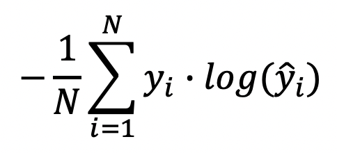
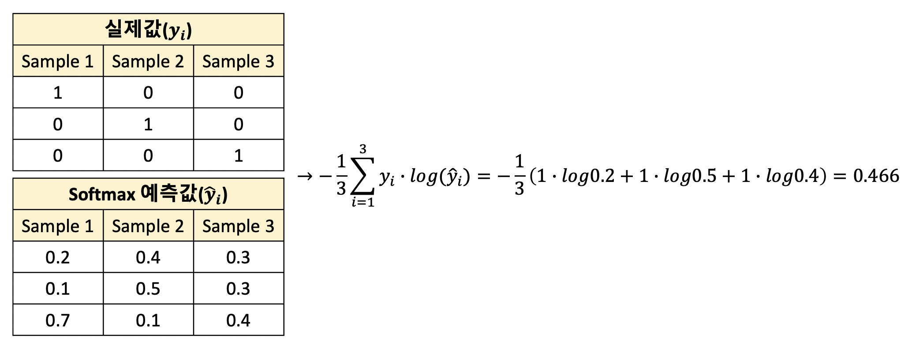
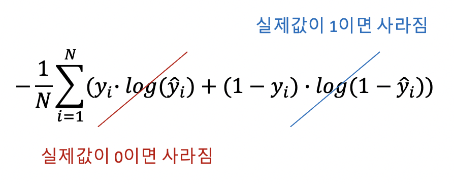

Categorical Cross-Entropy, Binary Cross-Entropy

----

안녕하세요.
데이터 사이언티스트를 위한 정보를 공유하고 있습니다.

M1 Macbook Air를 사용하고 있으며, 블로그의 모든 글은 Mac을 기준으로 작성된 점 참고해주세요.

----

# 손실 함수(Loss Function)

손실 함수는 실제값과 모델의 예측값의 차이를 나타내주는 함수입니다.

회귀에서는 MSE, MAE, RMSE가 사용됩니다.

MSE와 MAE에 대해서는 [회귀(Regression)](https://jeongchangsu.github.io/regression/) 포스팅을 확인해주시길 바랍니다.

RMSE는 MSE의 제곱근입니다.

그렇다면 이번 포스팅에서는 분류에 주로 쓰이는 손실 함수에 대해 알아볼 텐데요.

분류는 이진 분류(Binary Classificastion)와 다중 클래스 분류(Multi-Class Classification)로 나뉩니다.

각각에 맞는 손실 함수가 있는데

이진 분류에는 Binary Cross-Entropy,

다중 클래스 분류에는 Categorical Cross-Entropy가 사용됩니다.

----

# Categorical Cross-Entropy

수식은 다음과 같습니다.

소프트맥스 함수의 출력값의 로그 연산으로 계산되고,

데이터 샘플이 총 3개라고 하였을 때 다음과 같이 계산됩니다.

----

# Binary Cross-Entropy

Categorical Cross-Entropy와 큰 차이는 없고 다음과 같이 계산됩니다.

----

읽어주셔서 감사합니다.

정보 공유의 목적으로 만들어진 블로그입니다.

미흡한 점은 언제든 댓글로 지적해주시면 감사하겠습니다.

----
