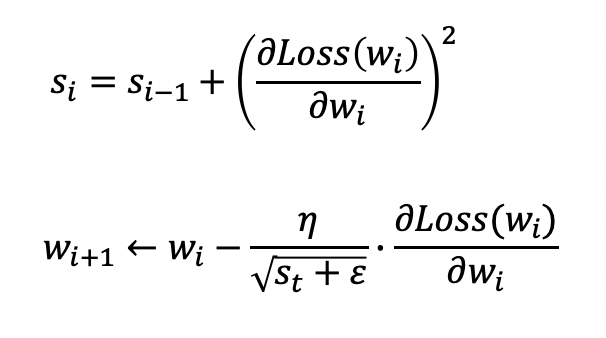

Optimizer, Momentum, AdaGrad, RMSProp, Adam

----

안녕하세요.
데이터 사이언티스트를 위한 정보를 공유하고 있습니다.

M1 Macbook Air를 사용하고 있으며, 블로그의 모든 글은 Mac을 기준으로 작성된 점 참고해주세요.

----

# 옵티마이저(Optimizer)

이름 그대로 최적화 기법으로서 보다 최적으로 경사 하강법(Gradient Descent)을 적용하기 위한 기법입니다.

즉 손실 함수(Loss Function)가 더욱 빠르고 안정적이게 최솟값에 수렴할 수 있도록 해주기 위한 것입니다.

경사 하강법을 통해 다음과 같이 가중치가 업데이트된다고 하였습니다.

이때 옵티마이저는 학습율(Learning Rate) 또는 경사 하강법 자체를 보정하는 방식이 있습니다.

# 1. Momentum

Momentum은 경사 하강법을 보정하는 방식의 옵티마이저입니다.

가중치 업데이트 시 가중치는 예측 오류를 최소화하기 위해 글로벌 미니마(Global Minima)로 향해야합니다.

그러나 로컬 미니마(Local Minima)에 빠지거나 고원(Plateau)에 머무는 경우가 생기는데 Momentum은 로컬 미니마에서 빠질 수 있도록 도와줍니다.

즉 기울기가 0인 지점에서도 관성에 의해 가중치가 업데이트될 수 있도록 해주는 것입니다.

Momentum을 반영한 새로운 기울기 값은 다음과 같습니다.

따라서 가중치는 다음과 같이 업데이트되게 됩니다.

Momentum 계수(γ)는 보통 0.9가 사용됩니다.

----

# 2. AdaGrad

AdaGrad는 학습율을 조정하는 방식의 옵티마이저입니다.

경사 하강법의 학습율은 고정되어 있는데

AdaGrad는 가중치 별로 서로 다른 학습율을 동적으로 적용합니다.

적게 변화된 가중치에는 큰 학습율을, 크게 변화된 가중치에는 작은 학습율을 적용합니다.

s는 그동안 적용된 기울기 제곱의 합이고, ε은 분모가 0이 되는 것을 방지하기 위한 값입니다.

s가 기울기의 제곱값이 사용되는 이유는 단지 학습율의 크기를 조절하기 위한 것이기 때문에 부호가 없는 절대값이 필요한 것입니다.

이렇게 AdaGrad가 적용되면 오류가 최저점에 가까워질수록 학습율이 작아지게 됩니다.

그러나 s가 누적되어 더해지는 것이 학습율을 지나치게 작게 만들 수 있다는 단점이 있는 옵티마이저입니다.

----

# 3. RMSProp

AdaGrad가 지나치게 작아지는 문제점을 극복한 옵티마이저입니다.

AdaGrad와 s를 구하는 수식이 조금 다릅니다.

여기서 사용되는 지수 가중 평균 계수(γ)는 보통 0.9가 적용되는데

이는 과거의 기울기 값의 영향력을 줄여주는 역할을 합니다.

보시다시피 기울기 값에 지수 가중 평균 계수가 누적되어 곱해지고 있고,

과거의 기울기는 점점 작아지면서 영향력이 작아지게 되는 것입니다.

----

# 4. Adam(Adaptive Moment Estimation)

Adam 옵티마이저는 RMSProp과 Momentum이 결합된 방식으로 볼 수 있습니다.

Momentum의 경우 실제로는 Momentum 옵티마이저와는 다르게

Momentum 계수가 아니라 지수 가중 평균 계수가 사용됩니다.

β1은 경사 하강법을 위한 지수 가중 평균 계수,

β2는 학습율을 위한 지수 가중 평균 계수이며,

두 계수 모두 0과 1사이에서 일반적으로 1에 가까운 값으로 사용됩니다.

----

읽어주셔서 감사합니다.

정보 공유의 목적으로 만들어진 블로그입니다.

미흡한 점은 언제든 댓글로 지적해주시면 감사하겠습니다.

----
